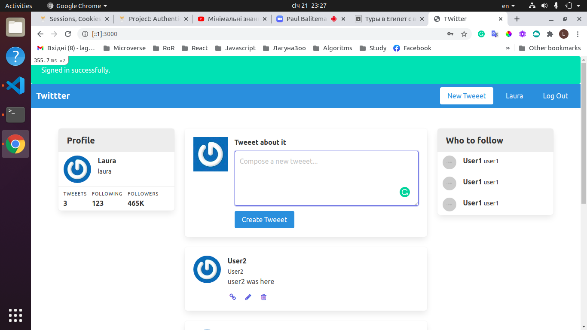

# README
T-witter clone

Web-Crunch youtube channel
Everything is working now

This README would normally document whatever steps are necessary to get the
application up and running.

Things you may want to cover:

* Ruby version
- ruby '2.7.2'
* System dependencies

* Configuration

* Database creation
-  `rails db:create`

* Database initialization
- `rails db:migrate`
* How to run 
run `rails s`
* Services (job queues, cache servers, search engines, etc.)

* Deployment instructions

* ...
